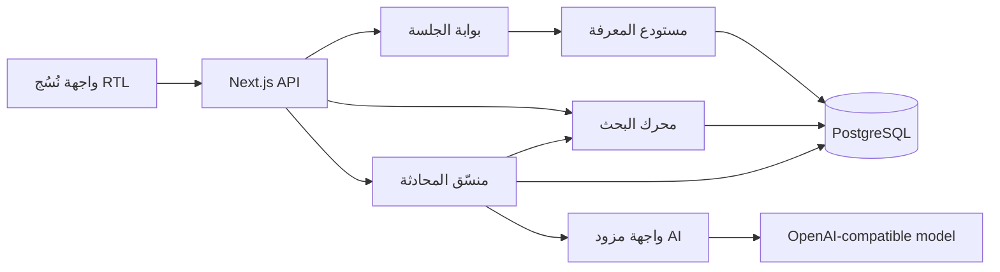
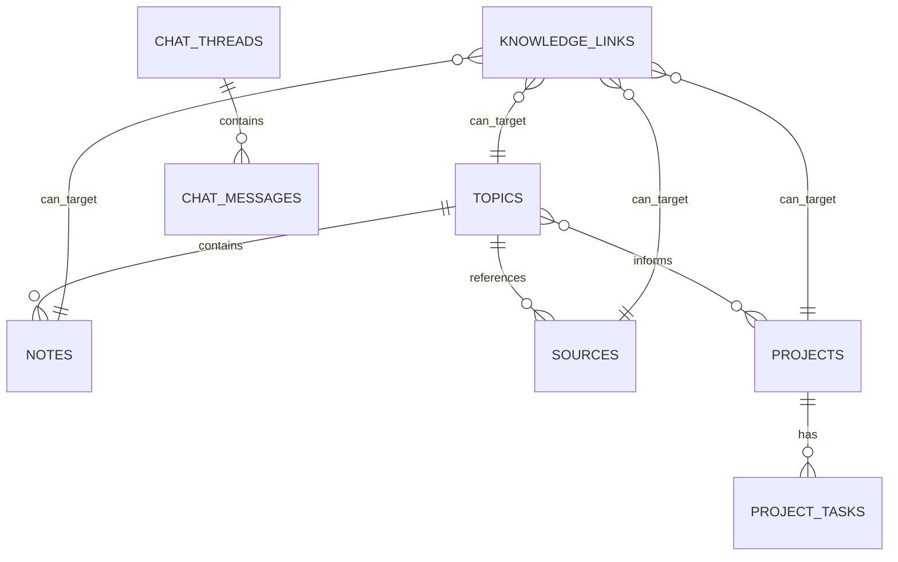

# التحليل المعماري المختصر

## القرار

أفضل MVP هنا هو **تطبيق متكامل واحد Modular Monolith**: واجهة Next.js وواجهات API في نفس الخدمة، PostgreSQL للحفظ والبحث، وطبقة AI مستقلة تدعم أي مزود متوافق مع OpenAI. هذا يقلل كلفة التشغيل والتعقيد الآن، مع حدود واضحة تسمح بفصل البحث والذكاء الاصطناعي لاحقاً.

## لماذا هذه البنية؟

- المعرفة مترابطة بطبيعتها؛ PostgreSQL مناسب للكيانات والعلاقات والبحث النصي.
- واجهة وخادم في مشروع واحد يسرّع التجربة والنشر على Render.
- طبقة AI لا تعرف تفاصيل الواجهة أو قاعدة البيانات؛ تستقبل سؤالاً وسياقاً فقط.
- وضع تجريبي في الذاكرة يجعل المشروع يعمل فوراً من دون قاعدة أو مفتاح نموذج.
- بوابة دخول لمستخدم واحد تحمي البيانات في الـMVP من رابط نشر عام.

## الوحدات

## نموذج البيانات

`knowledge_links` علاقة متعددة الأشكال تحفظ نوع الطرفين ومعرّفيهما، ونوع العلاقة، ودرجة الثقة، وسبب اقتراح الرابط. هذا مرن للـMVP؛ عند نمو الرسم إلى ملايين الروابط يمكن نقله إلى محرك Graph مستقل.

## تدفق AI

1. تدخل الرسالة عبر واجهة محمية.
2. يبحث النظام في المواضيع والملاحظات والمصادر والمشاريع.
3. يجمع أفضل ست نتائج كسياق.
4. يرسل السياق وتاريخاً قصيراً إلى المزود المتوافق.
5. يحفظ السؤال والإجابة في المحادثة.
6. إذا لم يوجد مفتاح مزود، يعيد محرك تجريبي إجابة واضحة ولا يدّعي أنها من نموذج متصل.

## حدود التوسع

- أضف `pgvector` وembeddings عند ثبوت أن البحث النصي غير كافٍ.
- افصل فهرسة الملفات في عامل خلفي عند دعم PDF والويب.
- استبدل بوابة المستخدم الواحد بمزود هوية وملكية صفوف قبل دعم عدة أشخاص.
- انقل المهام الاستباقية إلى queue/worker بعد التحقق من قيمة الاقتراحات للمستخدم.
